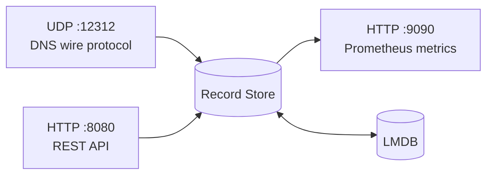
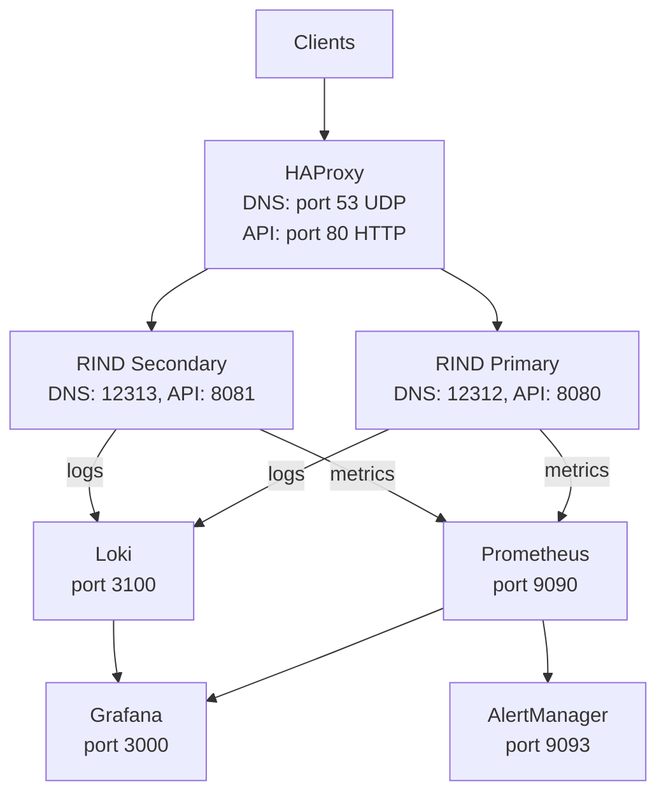
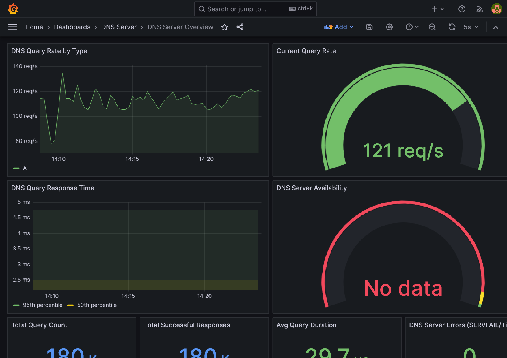
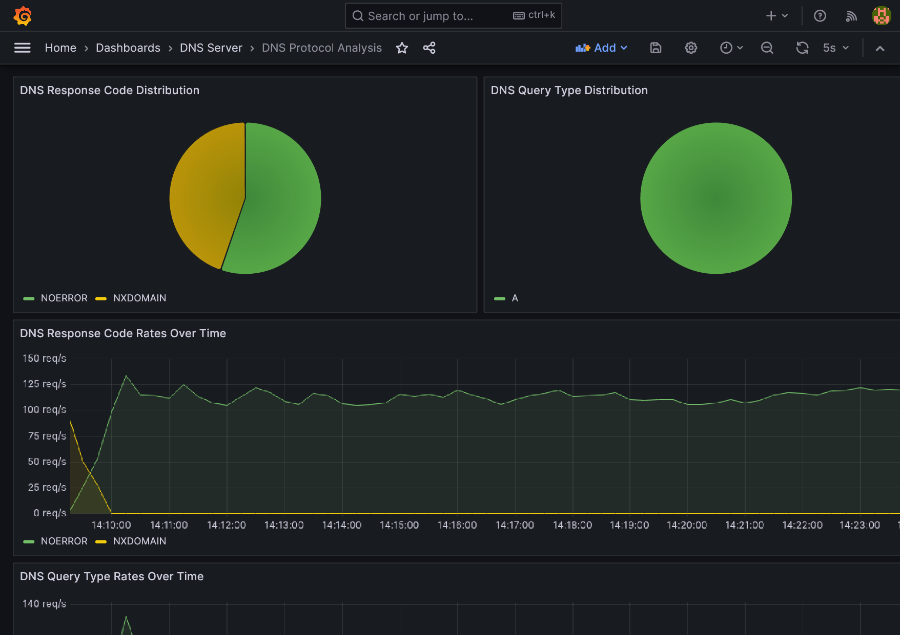
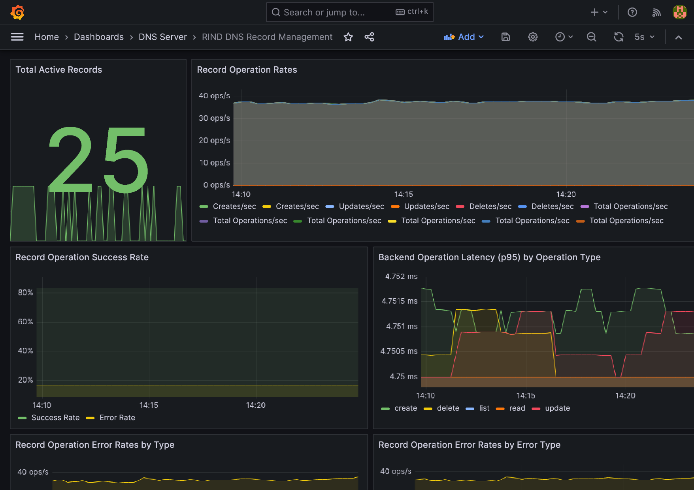
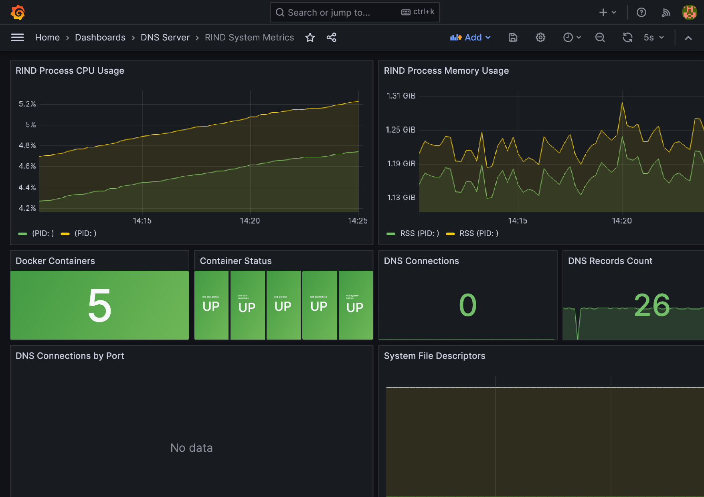
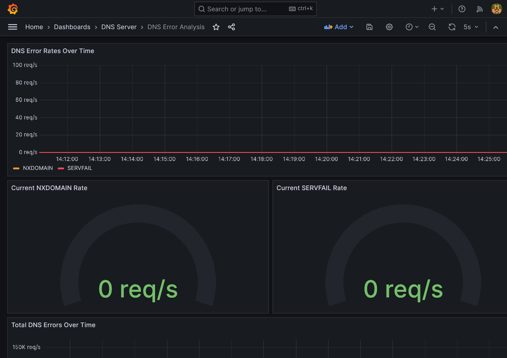

# RIND

RIND is a DNS server written in Rust. It speaks the DNS wire protocol over UDP and exposes a REST API for live record management, with Prometheus metrics built in. Designed to run as a primary/secondary pair behind a load balancer for HA deployments.

## Architecture

### Internals

A single RIND process runs three listeners against a shared record store:



- **UDP listener** — parses DNS queries, looks up the record store, encodes responses.
- **REST API** — CRUD over records, validated and applied to the same store.
- **Metrics endpoint** — exports query counts, latency histograms, error rates.
- **Persistence** — LMDB via `heed`. Every CRUD mutation is a single transaction covering the record store, the name index, a versioned changelog, and rolling state-hash metadata — so either all of it lands or none of it does. Chosen over a JSONL file for atomic multi-key writes, a durable changelog for replication, and no full-file rewrite on update.

### Deployment

Multiple instances compose into an HA setup behind HAProxy, with Prometheus, Grafana, Loki, and AlertManager providing observability:



## Quick Start

```bash
# Full stack with monitoring
./scripts/start-fullstack.sh start

# Or native development
cargo run
```

### Test it

```bash
# Add a record
curl -X POST http://localhost:8080/records \
  -H "Content-Type: application/json" \
  -d '{"name": "example.com", "ip": "93.184.216.34", "ttl": 300}'

# Query it
dig @localhost -p 12312 example.com

# List records
curl http://localhost:8080/records
```

## API

| Method | Endpoint | Description |
|--------|----------|-------------|
| `POST` | `/records` | Create a record |
| `GET` | `/records` | List records (paginated) |
| `PUT` | `/records/:name` | Update a record |
| `DELETE` | `/records/:name` | Delete a record |

## Development

```bash
cargo build --release
cargo test
cargo bench
cargo clippy --all-targets -- -D warnings
cargo fmt --check
```

CI runs `fmt --check`, `clippy`, and `test` on every push/PR via GitHub Actions.

## Monitoring

The full stack includes Prometheus, Grafana, Loki, and AlertManager. After starting:

- **Grafana**: http://localhost:3000 (credentials in `.env`, see `.env.example`)
- **Prometheus**: http://localhost:9090
- **HAProxy Stats**: http://localhost:8404/stats

### Dashboards

| Dashboard | Screenshot |
|-----------|------------|
| DNS Server Overview |  |
| DNS Protocol Analysis |  |
| Record Management |  |
| System Metrics |  |
| Error Analysis |  |

See [docs/METRICS.md](docs/METRICS.md) for available metrics and PromQL queries.

## Documentation

- [Full Stack Deployment](docs/FULLSTACK.md) — Docker Compose setup with monitoring
- [Docker Guide](docs/DOCKER.md) — Building and running containers
- [Metrics](docs/METRICS.md) — Prometheus metrics, Grafana dashboards
- [System Metrics](docs/SYSTEM_METRICS_GUIDE.md) — Infrastructure-level monitoring
- [Remote Deployment](docs/REMOTE_DEPLOYMENT.md) — Deploying to a remote host

## License

MIT — see [LICENSE](LICENSE).
