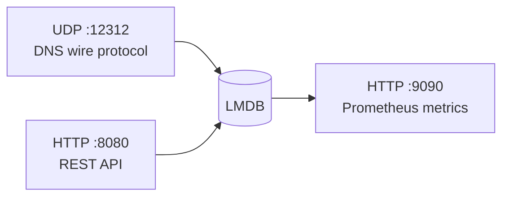
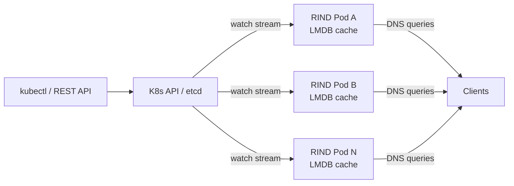

# RIND

RIND is a DNS server written in Rust. It speaks the DNS wire protocol over UDP and exposes a REST API for record management, with Prometheus metrics built in.

It runs in two modes:
- **Standalone** — LMDB is the authoritative store, works with `cargo run` or Docker Compose
- **Kubernetes** — etcd (via a DnsRecord CRD) is the authoritative store, LMDB is a local cache. All pods are equal, no leader election needed.

## Architecture

### Standalone Mode

A single RIND process runs three listeners against a shared LMDB store:



LMDB is opened via `heed`. Every CRUD mutation is a single transaction covering the record store, the name index, a versioned changelog, and rolling state-hash metadata — so either all of it lands or none of it does.

### Kubernetes Mode

Multiple identical pods each watch the DnsRecord CRD and sync to their local LMDB:



- DNS queries hit local LMDB only (no K8s API in the hot path)
- Writes go through `kubectl apply` or the REST API (which proxies to K8s API)
- HPA scales pods based on CPU; new pods sync from etcd on startup

## Quick Start

### Kubernetes (k3d)

```bash
# Install prereqs (docker, kubectl, k3d, dig). Idempotent — skip if you
# already have them. Detects pacman / apt / dnf / brew.
./scripts/install-prereqs.sh

# Spin up a local cluster with RIND
./scripts/k3d-setup.sh

# Create a DNS record
kubectl apply -f - <<EOF
apiVersion: dns.rind.dev/v1alpha1
kind: DnsRecord
metadata:
  name: my-record
  namespace: rind-system
spec:
  name: www.example.com
  ttl: 300
  recordData:
    type: A
    ip: "10.0.1.50"
EOF

# Query it
dig @localhost -p 30053 www.example.com

# List via REST API
curl http://localhost:30080/records
```

### Standalone (Docker Compose)

```bash
# Full stack with monitoring
./scripts/start-fullstack.sh start

# Or native development
cargo run
```

### Standalone (cargo)

```bash
cargo run

# Add a record
curl -X POST http://localhost:8080/records \
  -H "Content-Type: application/json" \
  -d '{"name": "example.com", "type": "A", "ip": "93.184.216.34", "ttl": 300}'

# Query it
dig @localhost -p 12312 example.com
```

## API

| Method | Endpoint | Description |
|--------|----------|-------------|
| `POST` | `/records` | Create a record |
| `GET` | `/records` | List records (paginated) |
| `GET` | `/records/:id` | Get a record by UUID |
| `PUT` | `/records/:id` | Update a record |
| `DELETE` | `/records/:id` | Delete a record |

In kubernetes mode, `POST`/`PUT`/`DELETE` proxy to the K8s API (creates/patches/deletes the CRD). `GET` always reads from local LMDB.

## DnsRecord CRD

Supported record types: `A`, `AAAA`, `CNAME`, `PTR`, `NS`, `MX`, `TXT`.

```bash
kubectl get dnsrecords -n rind-system    # or: kubectl get dr
```

See [docs/KUBERNETES.md](docs/KUBERNETES.md) for the full CRD reference and deployment guide.

## Building

```bash
# Standalone only
cargo build --release

# With Kubernetes support (CRD watcher + REST API shim)
cargo build --release --features kubernetes

# Docker (with Kubernetes support)
docker build --build-arg FEATURES=kubernetes -f docker/Dockerfile .
```

## Development

```bash
cargo test                              # standalone tests
cargo test --features kubernetes        # + CRD + watcher tests
cargo bench
cargo clippy --all-targets -- -D warnings
cargo fmt --check
```

To run the full CI gauntlet locally:

```bash
./scripts/ci-local.sh rust         # fmt + clippy + test, both feature flags
./scripts/ci-local.sh shellcheck   # bash lint + migrate-to-crd fixture test
./scripts/ci-local.sh manifests    # helm lint + kubeconform + kustomize render
./scripts/ci-local.sh smoke        # full k3d cluster smoke
./scripts/ci-local.sh all          # everything, in CI order
```

CI mirrors the same steps via `.github/workflows/ci.yml` on every push/PR.

## Deployment Options

| Method | Command | Use case |
|--------|---------|----------|
| k3d (local K8s) | `./scripts/k3d-setup.sh` | Local dev, testing |
| EKS (production) | `./scripts/eks-setup.sh` | Production AWS |
| Docker Compose | `./scripts/start-fullstack.sh start` | Standalone HA |
| Cargo | `cargo run` | Development |

## Monitoring

Prometheus metrics are exposed on `:9090/metrics`. In Kubernetes mode:

```bash
# Install monitoring stack (Prometheus + Grafana + Loki)
./k8s/monitoring/install.sh

# Access (via port-forward)
# Grafana:    http://localhost:3000  (admin / rind)
# Prometheus: http://localhost:9091
```

### Dashboards

| Dashboard | Content |
|-----------|---------|
| DNS Server Overview | Query rates, latency, error rates, canary health |
| DNS Protocol Analysis | Query types, response codes |
| Record Management | CRUD operations, validation errors |
| RIND System Metrics | CPU, memory, pod count per replica |
| DNS Error Analysis | SERVFAIL/NXDOMAIN breakdown |

See [docs/METRICS.md](docs/METRICS.md) for available metrics and PromQL queries.

## Documentation

- [Kubernetes Guide](docs/KUBERNETES.md) — CRD reference, k3d/EKS setup, migration
- [Full Stack Deployment](docs/FULLSTACK.md) — Docker Compose setup with monitoring
- [Docker Guide](docs/DOCKER.md) — Building and running containers
- [Metrics](docs/METRICS.md) — Prometheus metrics, Grafana dashboards
- [System Metrics](docs/SYSTEM_METRICS_GUIDE.md) — Infrastructure-level monitoring
- [Remote Deployment](docs/REMOTE_DEPLOYMENT.md) — Deploying to a remote host

## License

MIT — see [LICENSE](LICENSE).
